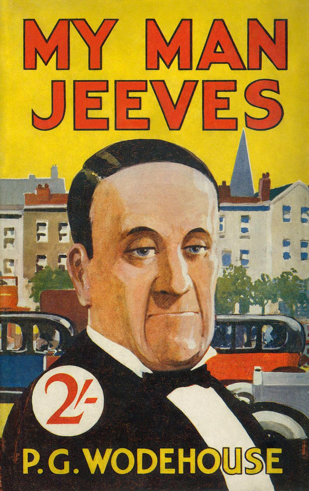

I thought that for the Keller Lab datasets, I would begin by looking at a subset of the time points (T390 to T399) and test the following denoising approaches:

* Noise2Void (Two Channels)
* Noise2Void (3-D, One Channel)
* CARE (2-D)
* Noise2Noise

The fact that one doesn't hear of such devices already, hints that there might be several, involved technical challenges. I quizzed a friend who has been working in the finance sector for the last three years and he was quick to point out that a good keeper of the minutes is one who (or which) can **eliminate extraneous conversations** and can capture the crucial components of the meeting. So that creates the possibility of combining Natural Language Processing (to weed out irrelevant conversations) and Deep Recurrent Neural Networks (for transcribing the audio to text). Another thing the friend mentioned is how when minutes are sent out by emailing, **some context is added** by the *minutes-keeper* so that a reader who wasn't present in the meeting would be able to make sense of the big picture surrounding an intense discussion. That would be an interesting challenge to tackle - as this implies **content creation** and probably falls (again) in the realm of Natural Language Processing.

Upon some brainstorming with other colleagues, I realised that another technical problem would be **handling multiple conversations at the same time**. I have heard that humans are quite good at [identifying](https://en.wikipedia.org/wiki/Cocktail_party_effect) one source of sound, distinct from another - I wonder if machines can do the same!

One (more) question which I don't have an answer to is why would a separate hardware be needed for fixing this solution. Would an app suffice, since nowadays phones have quite an impressive processor anyway and can do most of the tasks?

Think there is an opportunity from the point of view of a solving a technical problem. Many companies encourage sending out the minutes to all the concerned employees (just to put in writing all the points which were agreed upon earlier), so if implemented well, this piece of hardware could be used by a large clientele. However, whether these companies would be willing to buy such a product and would such a device justify its cost by improving the productivity of a company, seems hard to answer! .

I thought I would name this project **Jeeves** in reference to the eponymous valet who makes all problems disappear!

<figure><figcaption>[Reginald Jeeves from the series of books written by PG Wodehouse]</figcaption></figure>

  
