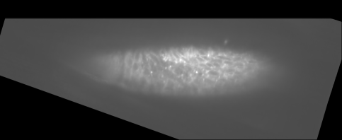
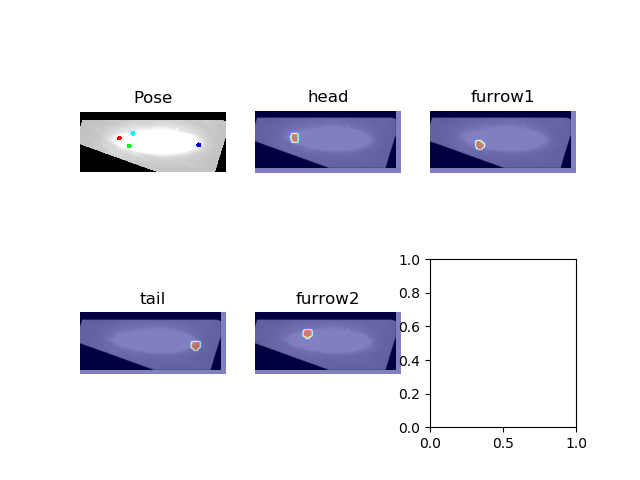

 
(From [Pischulin et al, 2019](https://arxiv.org/abs/1511.06645))
> "Key challenges inherent to multi person pose estimation are the partial visibility of some people, significant overlap of bounding box regions of people, and the a-priori unknown number of people in an image.  The problem thus is to infer the number of persons, assign part detections to person instances while respecting geometric and appearance constraints. Most strategies use a two-stage inference process to first detect and then independently estimate poses. This is unsuited for cases when people are in close proximity since they permit simulataneous assignment of the same body-part candidates to multiple people hypotheses."

<figure>

<figcaption>
[Figure One : From left to right (a) An image containing multiple people (b) Joints are predicted by Deeper Cut]</figcaption></figure>

Recently, I attempted to employ [Deeper Cut](https://arxiv.org/abs/1605.03170), which has traditionally been used for the purpose of human pose estimation, to instead, locate the *joints* of a *Drosophila* specimen. The broader goal of this task is to localize the cephalic furrow and to determine the proportion in which it divides the anterior-posterior axis. I proposed that considering the ends of the cephalic furrow as *joints* could serve as a proxy-task for obtaining the location of the furrow.

## Data Preparation

I downloaded 6 volumetric images, corresponding to the time points from 100 to 150, with a step of 10 and downscaled the images by a factor of 4 as the first step. Next, using the Single Point annotation tool in Fiji, I marked four joints corresponding to the Head, Furrow-End 1, Tail and Furrow-End 2 in all slices where these joints appeared easy to spot (around 40 slices per volumetric image). It helps to set the contrast to the maximum possible for clearer delineation of boundaries, while performing the annotation.

I next wrote some scripts to convert the annotations to a *dataset.mat*, which is used as input by the config file for training. The config file attributes are currently kept the same as default: would investigate these more closely in the later reruns. The first five volumetric images were converted to sliced, 2-D images and used for training, while the last volumetric image (time point 150) was used for testing the predictions. All the images are available [here](/home/manan/Desktop/jug-pc-x/04_Data/DeeperCut/11August2019).

## Training and Inference
The model was trained for more than four hours and seemed to have converged by around 220000 iterations (by default, it runs for a million iterations).  The prediction on the test slice images looks promising: the trained network can detect the locations of the four joints quite well. 

<figure>

<figcaption>
[Figure Two : From top to bottom (a) An input, test image (b) Joints are predicted correctly by Deeper Cut]</figcaption></figure>

While the prediction of the joints appears qualitatively correct, more quantitative analysis would need to be done. Another issue is that the two joints can not give a definitive picture of the profile of the furrow (one can simply draw a straight line which has no curvature information of the underlying furrow tissue). Can annotation of an additional joint in the middle of the furrow provide a better estimate of the profile?
