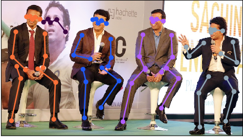

 
(From [Pischulin et al, 2019](https://arxiv.org/abs/1511.06645))
> "Key challenges inherent to multi person pose estimation are the partial visibility of some people, significant overlap of bounding box regions of people, and the a-priori unknown number of people in an image.  The problem thus is to infer the number of persons, assign part detections to person instances while respecting geometric and appearance con-straints. Most strategies use a two-stage inference process to first detect and then independently estimate poses. This is unsuited for cases when people are in close proximity since they permit simulataneous assignment of the same body-part candidates to multiple people hypotheses."

<figure>

<figcaption>
[Figure One : From left to right (a) An image containing multiple people (b) Joints or locations are predicted by Deeper Cut]</figcaption></figure>

Recently, I attempted to employ [Deeper Cut](https://arxiv.org/abs/1605.03170), which has traditionally been used for the purpose of human pose estimation, to instead, locate the *joints* of a *Drosophila* specimen. The broader goal of this task is to localize the cephalic furrow and to determine the proportion in which it divides the anterior-posterior axis. I proposed that considering the ends of the cephalic furrow as *joints* could serve as a proxy-task for obtaining the location of the furrow.

